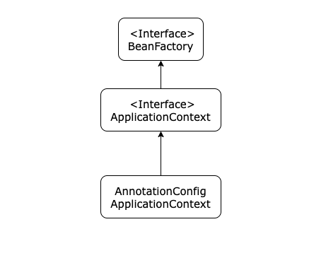
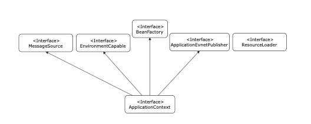

# BeanFactory와_ApplicationContext

> 출처 : 스프링 핵심 원리 - 기본편
>
> 
>
> BeanFactory와 ApplicationContext에 대해서 알아보자

## BeanFactory

* 스프링 컨테이너의 최상위 인터페이스다.
* 스프링 빈을 관리하고 조회하는 역할을 한다.
* `getBean()`을 제공한다.
* 우리가 사용하는 대부분의 기능은 BeanFactory가 제공하는 기능이다.

## ApplicationContext

* BeanFactory 기능을 모두 상속받아서 제공한다.
* 빈을 관리하고 조회하는 기능을 BeanFactory가 제공해주는데 둘의 차이는 ApplicationContext가 제공하는 부가 기능이 더 많다는 것이다.

### ApplicationContext가 제공하는 부가기능

* **메시지 소스를 활용한 국제화 기능**
  * 예를 들어 웹사이트에 접속한 국적이 한국이면 한국어로, 영어권에서 들어오면 영어로 출력
* **환경변수**
  * 로컬, 개발, 운영 등을 구분해서 처리
* **애플리케이션 이벤트**
  * 이벤트를 발행하고 구독하는 모델을 편리하게 지원
* **편리한 리소스 조회**
  * 파일, 클래스패스, 외부 등에서 리소스를 편리하게 조회

## 정리

* ApplicationContext는 BeanFactory를 상속 받는다.
* ApplicationContext는 빈 관리기능 + 편리한 부가 기능을 제공한다.
* BeanFactory를 직접 사용할 일은 거의 없다. 부가 기능이 포함된 ApplicationContext를 사용한다.
* BeanFactory나 ApplicationContext를 스프링 컨테이너라 한다.